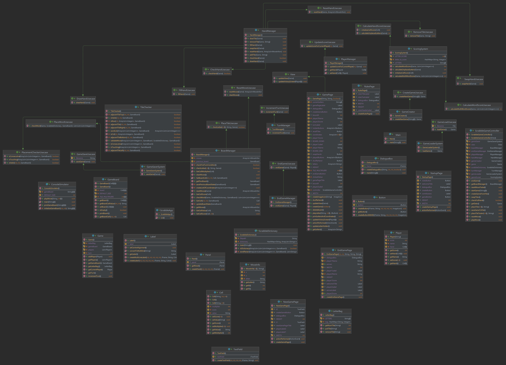

# Scrabble

Welcome to Scrabble, a game played and loved by millions around the world. Our team has decided to embark on a journey to rewrite 
scrabble using CSC207 principles and course concepts!

Team members: [Victor](https://github.com/victor-zheng-codes), [Clark](https://github.com/NearTruth), [Umair](https://github.com/Umair-H), [Jazli](https://github.com/Jazli14), [Francisco](https://github.com/Franciscozhou10), [Claire](https://github.com/ClaireRamsumair) and [Davit](https://github.com/Barsamyan-D).

# Table of Contents: 
1. [Functionalities and Specifications](#functionalities-and-specifications)
2. [Design Overview](#design-overview)
3. [UI Design](#ui-design)
4. [UML Diagram](#uml-diagram)
5. [Final Presentation](#final-presentation)
6. [How to Play Scrabble](#how-to-play-scrabble)
7. [Rules of the game](#rules-of-the-game)
8. [Use of GitHub Features](#github-features)
9. [Future Work](#future-work)

## Functionalities and Specifications
* Our application utilizes a fully implemented Swing GUI, where users can create, load, end, and play a full game of scrabble
* Our system checks words inputted for both validity and correct placement. A special case is implemented for the first word as well. 
* The game will automatically save after every move to allow for data persistence.
* A fully implemented score calculator that calculates the score of each tile placed on the board
* Abilities to swap tiles, shuffle tiles, recall tiles, and play tiles. 

## Design Overview
Our software broadly follows a User Flow Model below. We have omitted many smaller classes to focus on the larger design. Our software follows Clean Architecture, and we have taken a focused approach on dependencies. 

* **Entities**: our entities include our `Game`, `Cell`, `LetterBag`, `GameBoard`, and `Player` classes. 
* **Use Cases**: our use cases include, but are not limited to: `GameCreator`, `TileChecker`, `BoardManager`, `Scoring System`, `HandManager`,and `GameSave` and `GameCreate` classes
* **Controller**: our main controller is our `ScrabbleGameController`. We follow MVP UI architecture, where the controller acts as the Presenter.
* **User Interface**: our UI consists of mainly `GamePage`, `EndGamePage`, `CreateGamePage`, `RulesPage`, and `StartupPage`. These pages contain buttons which the user can click and interact with the software.

### Final Presentation
View the slides of our [final presentation](https://github.com/CSC207-2022F-UofT/course-project-scrabble/blob/main/slides.pdf). 

### UI Design 
The UI we designed looks as follows. The design on the right is the original conception, and the design on the left is the final product.
 
* light blue stars indicate squares with a doubling letter multiplier
* dark blue stars indicate squares with a tripling word multiplier
* the red star in the middle indicates where to place the first tile

### UML Diagram
Our UML Diagram, although hard to read, explains how our project works.

# How to play Scrabble
To make it easy for everyone to use our game, we have created the following short tutorial on running and playing our scrabble game. 

To begin, download our code: [Download Executable](https://drive.google.com/uc?export=download&id=1rhlJWxoBmJJDFtIvScbhsfdJfBq4ak1o) or view the [latest release](https://github.com/CSC207-2022F-UofT/course-project-scrabble/releases/latest)

### Rules of the game
We have written up [revised rules for scrabble](https://github.com/CSC207-2022F-UofT/course-project-scrabble/blob/main/resources/gui_resources/revised_rules_of_scrabble.md) for our game.
The rules of scrabble can also be visible through our UI pages.

### First Step: Running the Game
To run our game, a player can `Run Main.java` in their console or through Intellij. Immediately following the run, the following page should display.

### Second Step: Rules
Clicking on the `Rules` button will result in the following page. This can be convenient whenever someone wants to review how the game works!

## Third Step: Create Game
Clicking on the `Create Game` button will result in the following page. This button allows a user to start a new game from scratch with new player's names. The resulting page will pop up asking for the user to input their names.

## Fourth Step: Start Game
Clicking on the `Start Game` button on this page will result in the game loading. The game will take a few seconds to load as it must generate a large number of buttons. The following page will be visible after this step. There will be a 15x15 board, along with 7 tiles lining the bottom of the board. The 7 tiles consist of the available letters to be played. There are also five buttons located at the bottom for functionalities that will be explained below. 

## Fifth Step: Playing a Letter
If a user wants to play a letter, they must first click on the letter from the holder. They can click on any button on the holder. This will make the letter disappear, and the user will be only allowed to click on any tile in the 15x15 range to play their move. Following a click on any empty tile on the board, the letter will be immediately placed on the board. This continues until the user plays all of their moves. 

## Sixth Step: Playing a Word 
If the user decides that their preferred candidate move to play, they can press the `Play Move` button. This button will send the result to the "brain" of our application, and will spit back a result. If the word is valid, then it will indicate that it is the next player's turn to play. If the move is invalid, it will indicate that the move is invalid and display "Invalid Move" on the screen.

## Seventh Step: Swap Hands, Recall Tiles, ShuffleHands buttons
* If the user finds that their moves don't make sense and would like to replace their letters in another order, they can do so by pressing the `Recall Tiles` button. This will recall the tiles in the previous ordering seen at the start of the move.
* If the user finds that they really can't find a move, then the user can call the `Swap Hands` method to swap all 7 tiles in their hand. The softare will recall these tiles, place them back into the dictionary, and then draw another 7 tiles. 
* If the user finds that the hand is hard to read, and would like to move their tiles around, they can call the `Shuffle Hand` button, which moves the tiles on the holder around in a randomized order.

## Eighth Step: Game Play
Continue playing words and scoring words correctly.

## Final Step: Ending Game
If both players agree to end the game, then they can press the `End Game` button, which will calculate the scores of the game and display them back through our Exit page. Our application will also calculate if there are no tiles left to be played, which will also end the game according to our rules. The winner will then be displayed for everyone to see.

# GitHub Features
We have tried to use the full functionality of GitHub by using GitHub projects, pull requests, issues, code reviews, and actions. In particular, we realized that our original use of the `main` branch as the running code wasn't the greatest idea. Whenever we were merging various changes together, there would be errors that made us have to spend hours debugging. Thus, we decided to create a `develop` branch to develop code, and only have `main` have running code. This is something that we found out after looking through the following [GitHub recommendation](/resources/github_pipeline.png).

# Future Work
When we began this project this semester, we had planned much more than what we accomplished. Although we are proud of our work, we think there are features that would be interesting to add on. Some of these features are listed below. 
* Computer AI to determine all possible moves and best move in each position
* Tournament software to play numerous people
* Web based game to allow playing online against others
* Multiplayer options to allow for more than 2 players
* Faster speeds to allow for games to be played without needing to wait for computations
* Android application (since this was coded in Java, this shouldn't be too difficult)
* Word multipliers instead of just letter multipliers.